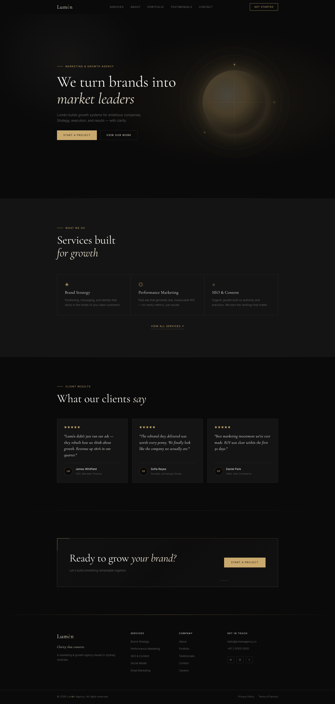

# Lumèn Agency — Marketing & Growth Agency Website

A fully responsive, multi-page marketing agency website built for **Lumèn** — a Sydney-based growth agency. Designed with a minimal, luxury aesthetic and a smooth, polished user experience across all devices.

---

## 🌐 Live Demo

**[View Live Site →](https://rasyidbejay.github.io/lumen-agency/)**

---

## 📸 Screenshots



---

## 🛠️ Built With

| Technology | Purpose |
|---|---|
| [Vue 3](https://vuejs.org/) (Composition API) | UI framework & component architecture |
| [Vite](https://vitejs.dev/) | Build tool & dev server |
| [Vue Router](https://router.vuejs.org/) | Client-side routing |
| CSS3 with Custom Properties | Design system & theming |
| Intersection Observer API | Scroll-triggered animations |
| Google Fonts | Cormorant Garamond + Inter typography |
| [gh-pages](https://github.com/tschaub/gh-pages) | GitHub Pages deployment |

---

## ✨ Features

- **Multi-page routing** — Six distinct pages via Vue Router (Home, Services, About, Portfolio, Testimonials, Contact)
- **Luxury dark theme** — Custom CSS property design system with gold accents (`#C9A96E`) and warm off-white typography
- **Scroll animations** — Fade-in + slide-up transitions on every section using native Intersection Observer (no libraries)
- **Fully responsive** — Mobile-first layout with breakpoints at 480px, 640px, 768px, 900px, and 1024px
- **Filterable portfolio** — Category filter with Vue computed properties; instant reactive filtering, no page reload
- **Contact form validation** — Reactive validation using `reactive()` with inline blur events and a success state
- **Reusable component system** — `PageHero`, `CtaBanner`, and section components compose each page view
- **Dynamic copyright year** — Computed property keeps the footer year always current
- **CSS-only abstract visuals** — Hero orb built entirely from gradients, box-shadows, and CSS animations — no images

---

## 📁 Project Structure

```
src/
├── assets/
│   └── main.css               # Global CSS variables, reset, utilities, animations
├── components/
│   ├── NavBar.vue             # Sticky nav with hamburger menu & RouterLink
│   ├── HeroSection.vue        # Full-viewport hero with CSS orb visual
│   ├── ServicesSection.vue    # 6-card service grid (supports :limit prop for preview)
│   ├── AboutSection.vue       # Two-column layout with stats row & photo grid
│   ├── PortfolioSection.vue   # Filterable 6-project grid
│   ├── TestimonialsSection.vue # 3-card testimonial layout
│   ├── ContactSection.vue     # Two-column contact form with validation
│   ├── FooterSection.vue      # 4-column footer with dynamic year
│   ├── PageHero.vue           # Reusable page banner (label + heading + subtext)
│   └── CtaBanner.vue          # Reusable CTA box with RouterLink button
├── router/
│   └── index.js               # Vue Router config with 6 named routes
├── views/
│   ├── HomeView.vue           # Hero + 3 service preview + Testimonials + CTA
│   ├── ServicesView.vue       # PageHero + full ServicesSection + CTA
│   ├── AboutView.vue          # PageHero + About + Testimonials + CTA
│   ├── PortfolioView.vue      # PageHero + PortfolioSection + CTA
│   ├── TestimonialsView.vue   # PageHero + Testimonials + stats row + CTA
│   └── ContactView.vue        # PageHero + ContactSection + reassurance row
├── App.vue                    # Root: NavBar + RouterView + FooterSection
└── main.js                    # App entry — mounts Vue with router + global CSS
```

---

## 🚀 Getting Started

### Prerequisites

- Node.js `^20.19.0` or `>=22.12.0`
- npm

### Installation

```bash
# Clone the repository
git clone https://github.com/rasyidbejay/lumen-agency.git
cd lumen-agency

# Install dependencies
npm install

# Start local development server
npm run dev
```

The dev server will be available at `http://localhost:5173`.

### Build for Production

```bash
npm run build
```

Output is generated in the `dist/` folder.

### Preview Production Build

```bash
npm run preview
```

---

## 📦 Deployment

This project is deployed to **GitHub Pages** using the `gh-pages` package.

```bash
npm run deploy
```

This runs `npm run build` automatically (via the `predeploy` script), then pushes the `dist/` folder to the `gh-pages` branch of the repository.

> The Vite config includes `base: '/lumen-agency/'` to ensure all assets resolve correctly under the GitHub Pages subdirectory.

---

## 👨‍💻 Author

**Built by MM** — web developer specialising in Vue, WordPress, and Shopify.

- GitHub: [@rasyidbejay](https://github.com/rasyidbejay)
- Live: [rasyidbejay.github.io/lumen-agency](https://rasyidbejay.github.io/lumen-agency/)

---

## 📄 License

This project is open source and available under the [MIT License](LICENSE).
